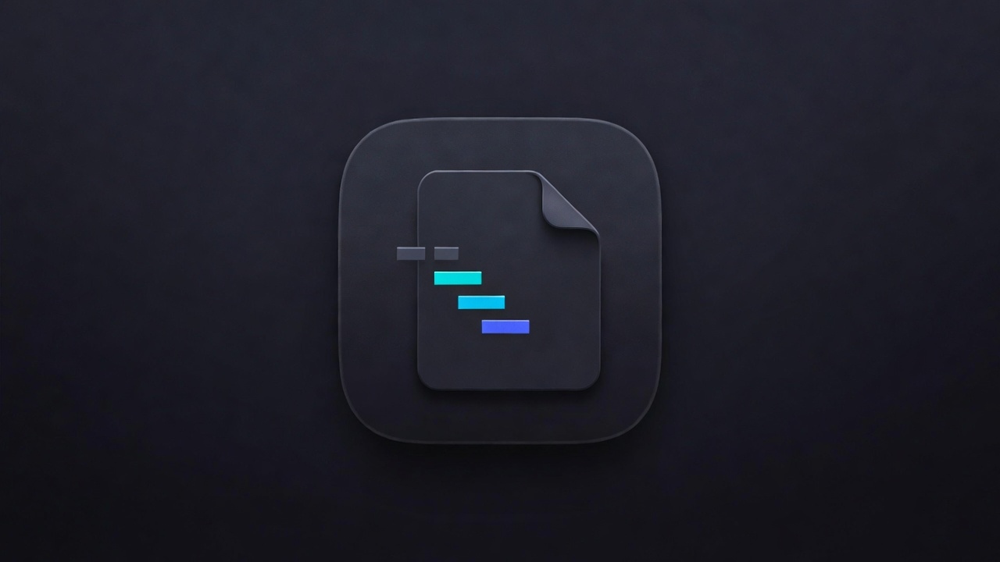
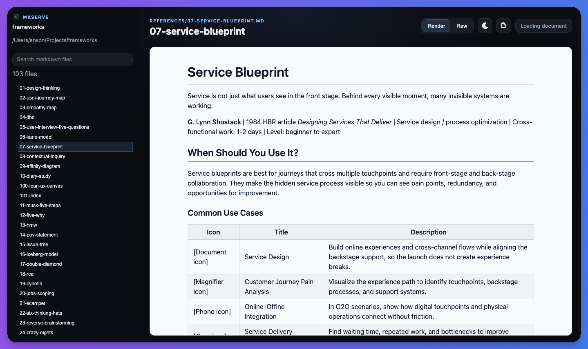

# mkserve

Turn any local markdown folder into a browsable docs site.



## Install

```bash
bun install
bun link
```

## Usage

```bash
mkserve ./
mkserve ../docs --port 4000
mkserve --help
```




## License

MIT
